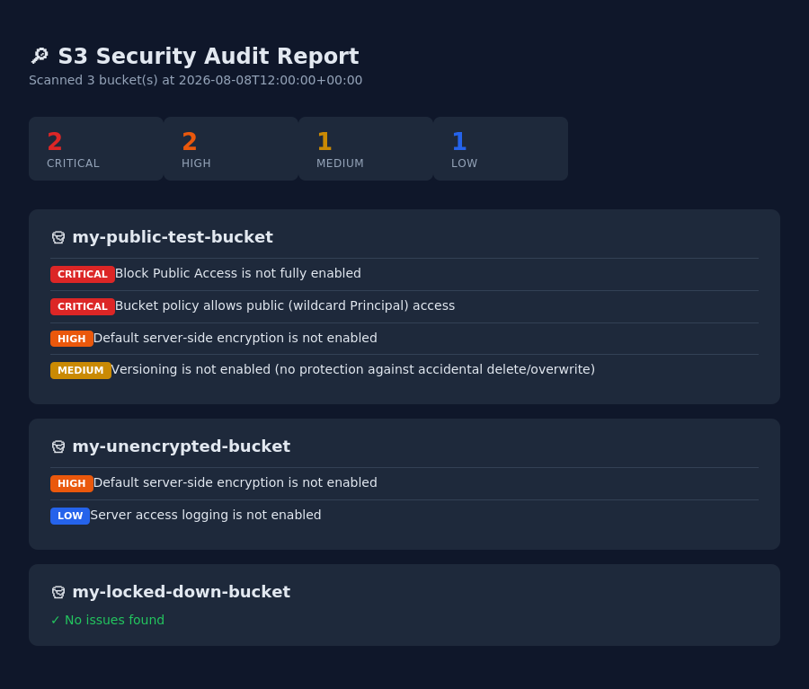

# S3 Security Auditor

A lightweight Python tool that scans every S3 bucket in an AWS account and flags
common misconfigurations — the same class of issues behind real-world breaches
like Capital One (2019) and multiple leaked government/corporate datasets found
by security researchers scanning for open buckets.



## What it checks

| Check | Why it matters | Severity |
|---|---|---|
| Block Public Access disabled | Bucket/objects can be exposed to the internet | Critical |
| Public ACL grants | Explicit read/write access to "AllUsers" or "AuthenticatedUsers" | Critical |
| Public bucket policy | Wildcard `Principal: *` allows anyone to access the bucket | Critical |
| No default encryption | Data at rest isn't encrypted by default | High |
| Versioning disabled | No protection against accidental deletion, overwrite, or ransomware | Medium |
| Access logging disabled | No audit trail if the bucket is accessed or modified | Low |

## Setup

1. **Create a read-only IAM user** for the scanner (never use root/admin credentials):
   - Attach the policy in [`iam-policy.json`](./iam-policy.json) — it only grants
     read access to bucket metadata, nothing else.
   - Generate an access key for that user and run `aws configure` locally, or set
     `AWS_ACCESS_KEY_ID` / `AWS_SECRET_ACCESS_KEY` env vars.

2. **Install dependencies:**
   ```bash
   pip install -r requirements.txt
   ```

3. **Run the scanner:**
   ```bash
   python scanner.py
   # or with a named profile:
   python scanner.py --profile my-audit-profile
   ```
   This produces `report.json`.

4. **Generate the HTML report:**
   ```bash
   python report.py report.json
   ```
   Open `report.html` in a browser.

## Example output

```
[*] Found 3 bucket(s). Scanning...

  [CRITICAL] my-public-test-bucket — 4 finding(s)
  [HIGH    ] my-unencrypted-bucket — 2 finding(s)
  [OK      ] my-locked-down-bucket — no issues found

[*] Full report written to report.json
```

## Lessons learned

Building this made a few things click that are easy to gloss over in theory:

- **S3 buckets are private by default in new accounts, but "default" isn't the
  same as "protected."** A single overly broad bucket policy or ACL grant can
  override sane defaults — which is exactly how so many public-bucket leaks
  happen. Defense in depth (Block Public Access *and* policy review *and*
  ACL review) matters because any one control alone can be misconfigured.
- **IAM least privilege isn't just theory.** Scoping the scanner's own
  credentials to read-only, bucket-metadata-only actions means that even if
  those credentials leaked, they couldn't modify or exfiltrate actual data.
- **Encryption and versioning are cheap insurance.** Both are a single API
  call to enable and cost essentially nothing, but protect against two very
  different failure modes: data exposure and data loss.

## Stretch goals

- [ ] AWS Lambda + EventBridge to run this on a schedule
- [ ] SNS/email/Slack alerts for new Critical findings
- [ ] Multi-account scanning via AWS Organizations
- [ ] Terraform/CloudFormation drift detection (flag *changes* since last scan)

## Disclaimer

This tool only reads metadata (ACLs, policies, config flags) — it never reads
or downloads object contents. Always run it against accounts you own or have
explicit authorization to audit.
